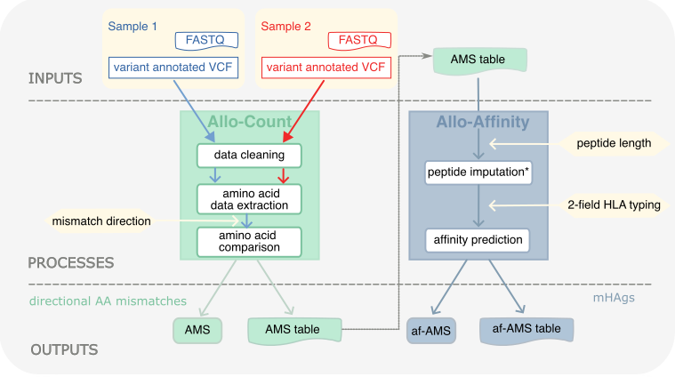

# AlloPipe


The AlloPipe tool is a computational workflow designed to compute, given a pair of annotated human genomic datasets:
  1. **directional amino acid mismatches**, and 
  2. the related candidate **minor histocompatibility antigens**. 


The product is provided free of charge, and, therefore, on an "as is" basis, without warranty of any kind. <br/>
AlloPipe is also available as a [web application](https://www.allogenomics.com).

---
## In a nutshell

**The AlloPipe tool is divided into two sequential modules: Allo-Count, then Allo-Affinity.**


<br/>
<p align="center">
	
</p>

<br/>

### (1) Allo-Count imputes the directional amino acid mismatches from two genomic datasets

After reformating relevant data from the variant-annotated `.VCF` file(s), Allo-count performs a stringent data cleaning and computes the **directional comparison** of the genomic sequences from sample 1 and sample 2. 

 <br/>
 
 Allo-Count returns: <br/>
- **a quantitative output** called the **Allogenomic Mismatch Score (AMS)**: a discrete quantitative variable that is counting the number of directional amino acid mismatches.
- **a qualitative output** stored in the **AMS (mismatch) table**: providing information about the polymorphisms contributing to the AMS.
  
<br/>  

> **Directional comparison**
> 
> The sample comparison is directional and accounts for either polymorphisms that are present in the donor 
> but absent in the recipient (*donor-to-recipient*) or that are present in the recipient but absent in the donor (*recipient-to-donor*).
>  - **_Donor-to-recipient_** accounts for polymorphisms present by the donor but absent by the recipient, i.e. triggerring the recipient's immune system after **solid organ transplantation**.
>   - **_Recipient-to-donor_** accounts for polymorphisms present by the recipient but absent by the donor, i.e. triggerring the donor's immune system after **allogeneic haematopoietic cell transplantation**.

<br/>
<br/>

### (2) Allo-Affinity imputes minor histocompatibility antigen (mHAgs) candidates

Allo-Affinity **reconstructs peptides** of requested length around the polymorphisms present in the mismatches tables.<br/>
The affinity of those peptides towards the HLA molecules can then be assessed using third party tools such as [NetMHCpan](https://pubmed.ncbi.nlm.nih.gov/32406916/) or [MixMHCpred](https://www.biorxiv.org/content/10.1101/2024.05.08.593183v1) softwares, to retrieve the candidate mHAgs.

*Please read the terms of use for the NetMHCpan and MixMHCpred softwares. 4-digit HLA typing must be provided by the user for the HLA molecules of interest, including the alpha/beta chain combination for HLA-DR and HLA-DQ molecules.*


<br/>
<br/>

### Modes of operation (single pair or multiple pair/cohort)

There are two modes of operation for each module: as single pair or as multiple pairs
	
- **Single pair**: 
Run as 'single pair mode' if you aim to compute AMS and/or affinity-AMS (af-AMS) for one pair at a time. \
You need to provide one variant-annotated `.VCF` file per individual.
 
- **Cohort** (Multiple pairs): 
Run as 'multiple pairs mode' if you aim to compute AMS and/or af-AMS for more than one pair at a time.\
You need to provide one unique variant-annotated `.VCF` file containing the genotypes of all individuals you want to analyse - i.e. a joint `.VCF` file - and the [`.csv` formatted list](./tutorial/example.csv) of the pairs you want to process.

<br/>

---

# Table of contents

1. [Before getting started](#before)
	1. [Requirements](#requirements)
	2. [AlloPipe installation](#install)
	3. [Preprocessing the input data: variant annotation](#vep)
    
<br/>

2. [Running the AlloPipe workflow](#run)
	1. [Running Allo-Count](#ams_run)
		1. [Single pair](#single_ams)
		2. [Multiple pairs](#multi_ams)
		3. [Exploring the AMS table](#ams_table)
	2. [Running Allo-Affinity](#aams_run)
		1. [Single pair](#single_aams)
		2. [Multiple pairs](#multi_aams)
		3. [Exploring the af-AMS table](#aams_table)
		4. [Predicting cleaved peptide](#cleavage)

<br/>
     
  3. [Tutorial](#tuto)

<br/>

---

## Before getting started <a name="before"></a>

### &nbsp;&nbsp;&nbsp;&nbsp;&nbsp;&nbsp;&nbsp;&nbsp;(i) Requirements<a name="requirements"></a>

For installing AlloPipe you will specifically require the following softwares:
1. [Python](https://www.python.org/downloads/) ≥ 3.6 (AlloPipe was developed on v3.9)

2. [Conda](https://docs.anaconda.com/free/working-with-conda/) installed for your operating system and python version. Verify that you have a suitable version of Conda, as we recommend installing the [dependencies](https://github.com/huguesrichard/Allopipe/blob/main/requirements.txt) in a dedicated environment.

3. To run Allo-Affinity, you need to assess the affinity of the reconstructed peptides towards the HLA molecules. We recommend two groups of software suites for that (only NetMHCpan is supported in command line for now):
	- [NetMHCpan](https://services.healthtech.dtu.dk/service.php?NetMHCpan-4.1) and [NetMHCIIpan](https://services.healthtech.dtu.dk/services/NetMHCIIpan-4.3/), which should be downloaded as command line tools (be careful with version numbers).
	- [MixMHCpred](https://github.com/GfellerLab/MixMHCpred) and [MixMHC2pred](https://github.com/GfellerLab/MixMHC2pred) (support development in progress).
4. To predict proteasomal cleavage on the proteins of the donor or the recipient, you will also need the [NetChop](https://services.healthtech.dtu.dk/services/NetChop-3.1/) tool installed as a standalone version. 

*Make sure you use each software in accordance with its user license.*

 
<br/>

### &nbsp;&nbsp;&nbsp;&nbsp;&nbsp;&nbsp;&nbsp;&nbsp;(ii) AlloPipe installation <a name="install"></a>

1) Clone the repository from git\
*You might be requested to create a token for you to log in. See the [GitHub tutorial](https://docs.github.com/en/authentication/keeping-your-account-and-data-secure/managing-your-personal-access-tokens#creating-a-personal-access-token-classic)*

2) Create a conda environment dedicated to the AlloPipe workflow
3) Install the AlloPipe requirements within the conda environment
   
The following command lines will perform steps 1 to 3:
```
	git clone https://github.com/huguesrichard/Allopipe.git
	cd Allopipe
	conda create --name Allopipe python=3.9
	conda activate Allopipe
	python -m pip install -r requirements.txt
```
1) Remember that to run prediction of affinity for the peptides you will also need NetMHCpan installed (NetChop to account for proteasomal cleavage).

### &nbsp;&nbsp;&nbsp;&nbsp;&nbsp;&nbsp;&nbsp;&nbsp;(iii) Preprocess the input data: variant annotation <a name="vep"></a>

<br/>

**AlloPipe input file(s) must be variant-annotated `.VCF` file(s). We highly recommend performing the variant annotation with the most recent version of VEP using the command line installation and all the arguments specified below.**

<br/>

>*Any variant annotator could be used at this step, but keep in mind that AlloPipe has been developed with `.VCF` files in version 4.2 annotated with VEP command line installation for versions older than 103.*

<br/>

To install the VEP command line tool, follow the installation tutorial available [here](https://www.ensembl.org/info/docs/tools/vep/script/vep_download.html#download).\
		During the installation, you will be asked if you want to download **cache** files, **FASTA** files and **plugins**.
   - We **recommend downloading the cache files** for the assembly of your `.VCF` files to be able to run VEP offline.\
	Download the VEP cache files which correspond to your Ensembl VEP installation and genome reference!
   - We **recommend downloading the FASTA files** for the assembly of your `.VCF` files to be able to run VEP offline.\
	Download the FASTA files which correspond to your Ensembl VEP installation and genome reference!
   - We **do not recommend downloading any plugin**
      
 We then recommend **adding VEP to your PATH** by adding the following line to your `~/.profile` or `~/.bash_profile`:
```
	export PATH=%%PATH/TO/VEP%%:${PATH}
```


Run the following command to annotate your `.VCF` file(s) with VEP.

**All specified options are mandatory, with the exception of the assembly if you only downloaded one cache file.**  
```
	vep --fork 4 --cache --assembly <GRChXX> --offline --af_gnomade -i <FILE-TO-ANNOTATE>.vcf -o <ANNOTATED-FILE>.vcf --coding_only --pick_allele --use_given_ref --vcf 
```

Where:
 - ```<GRChXX>``` is the version of the genome used to align the sequences.
 - ```<FILE-TO-ANNOTATE>.vcf``` is the path to your file to annotate.
 - ```<ANNOTATED-FILE>.vcf``` is the path to the output annotated file.

This command line works for individual `.VCF` files or joint `.VCF` files, whether compressed (`.vcf.gz`) or not (`.vcf`). 
Run this command for every file you want to input in AlloPipe.

**Once the variant-annotation of your file(s) is(are) complete, you are now ready to run your first AlloPipe run!**

<br/>

---

## Running the AlloPipe workflow <a name="run"></a>

### &nbsp;&nbsp;&nbsp;&nbsp;&nbsp;&nbsp;&nbsp;&nbsp; (i)Running Allo-Count  <a name="ams_run"></a>

<br/>

**Which parameters Allo-Count considers?**

From variant-annotated `.VCF` file(s), data are first reformatted to obtain one data frame per individual.\
Those data frames are then filtered considering a set of quality metrics (defaults values):
- minimal depth per position (20x)
- maximal depth per position (400x)
- minimal allelic depth (5x)
- homozygosity threshold (0.2)
- GnomADe allele frequency threshold (0.01)
- genotype quality threshold (0: you might adjust this value according to your sequencing platform)
- maximal length for insertions or deletions (indels, 3)

The curated data frames are then queried to assess the **directional mismatches** between samples.

<br/>

> **Directional comparison**
> 
> The sample comparison is **directional** and accounts for either polymorphisms that are present in the donor but absent in the recipient (*donor-to-recipient*) or that are present in the recipient but absent in the donor (*recipient-to-donor*).
> - **_Donor-to-recipient_** accounts for polymorphisms present by the donor but absent by the recipient, i.e. triggering the recipient's immune system after **solid organ transplantation**.
> - **_Recipient-to-donor_** accounts for polymorphisms present by the recipient but absent by the donor, i.e. triggering the donor's immune system after **allogenic hematopoietic cell transplantation**.
> 
<br/>

**How does AlloPipe handle missing data?**

We provide the possibility to impute genotype missing data as being ref/ref (e.g. `0/0` or homozygous on the nucleotide of reference.
 - If you are using individual `.VCF` files as input ('single pair mode'), you most probably want to run with the `imputation` argument as ref/ref variants are omitted in those files.

 - If you are using joint `.VCF` ('multiple pairs mode'), running with the `no-imputation` argument will only keep variants sequenced in the two datasets of each pair.
<br/>

#### &nbsp;&nbsp;&nbsp;&nbsp;&nbsp;&nbsp;&nbsp;&nbsp;&nbsp;&nbsp;&nbsp;&nbsp;&nbsp;&nbsp;&nbsp;&nbsp; (a) Running Allo-Count for a single pair <a name="single_ams"></a>

Once the variant-annotation is complete, go to the root of the AlloPipe directory to run the following commands in the terminal

*Do not forget to activate your conda environment with `conda activate Allopipe`!*  
```
	cd src/
	python ams_pipeline.py -n <NAME-RUN> <DONOR-ANNOTATED-FILE>.vcf <RECIPIENT-ANNOTATED-FILE>.vcf <MISMATCH-DIRECTION> <IMPUTATION-MODE>
```

Where:
- ```<NAME-RUN>``` is the name of the run
- ```<DONOR-ANNOTATED-FILE>.vcf``` is the path to the donor's annotated `.VCF` 
- ```<RECIPIENT-ANNOTATED-FILE>.vcf``` is the path to the recipient's annotated `.VCF`
- ```<MISMATCH-DIRECTION>```: `dr`, present in the donor but absent in the recipient ; `rd`, present in the recipient but absent in the donor
- ```<IMPUTATION-MODE>``` is the imputation mode. We recommend to use the imputation mode (`imputation`) when running AlloPipe from individual `.VCF` files.

More detailed help can be obtained with the ``--help`` switch:

```
python ams_pipeline.py --help
```  

<br/>


#### &nbsp;&nbsp;&nbsp;&nbsp;&nbsp;&nbsp;&nbsp;&nbsp;&nbsp;&nbsp;&nbsp;&nbsp;&nbsp;&nbsp;&nbsp;&nbsp; (b) Running Allo-Count for multiple pairs <a name="multi_ams"></a>

It is possible to run Allo-Count from an annotated joint `.VCF` file containing the genomic data of interest.
In that case, you need to provide an [example.csv](./tutorial/example.csv) specifying the donor/recipient pairs.
```
	cd src/
	python multiprocess_ams.py -n <NAME-RUN> <JOINT-ANNOTATED-FILE>.vcf <PAIR-LIST>.csv <MISMATCH-DIRECTION> <IMPUTATION-MODE>
```

Where:
- ```<NAME-RUN>``` is the name of the run
- ```<JOINT-ANNOTATED-FILE>.vcf``` is the path to the annotated joint `.VCF` file
- ```<PAIR-LIST>.csv``` is the path to the list pairing the samples [example.csv](./tutorial/example.csv)
- ```<MISMATCH-DIRECTION>``` is the direction of the mismatch as previously described
- ```<IMPUTATION-MODE>``` is the imputation mode. Running with no-imputation mode (`no-imputation`) will explicitly rule out from the analysis variants that were not genotyped in both sample.

*Only one directional comparison is accepted within the same command line.*

<br/>

Again, more detailed help can be obtained with the ``--help`` switch:
```
	python multiprocess_ams.py --help
```


#### &nbsp;&nbsp;&nbsp;&nbsp;&nbsp;&nbsp;&nbsp;&nbsp;&nbsp;&nbsp;&nbsp;&nbsp;&nbsp;&nbsp;&nbsp;&nbsp; (c) Exploring the Allo-Count output <a name="ams_table"></a>

After the run is complete, have a look at the **output/runs/NAME-RUN/** directory that was created.  
The directory is structured as followed :  
 - the **`AMS/`** subdirectory contains the AMS value(s)
 - the **`plots/`** subdirectory contains visual output
 - the **`run_tables/`** subdirectory contains the tables created during the run. 

In the **`run_tables/`** directory, you can find:

<br/>

&nbsp;&nbsp;&nbsp;&nbsp;&nbsp;&nbsp; **1)** **`D0-TABLE`** and **`R0-TABLE`**: 
The D0/R0 tables are tab delimited files that summarize the genotype information contained in the `.VCF` file(s), whether individual or joint.

They can be used to navigate through this data in a more simple way, by opening them with a spreadsheet software.


&nbsp;&nbsp;&nbsp;&nbsp;&nbsp;&nbsp; **2)** The **`MISMATCHES-TABLE`**: 
This table gives you information on the mismatched positions. For each type of information (VCF, Sample, VEP, AlloPipe results), the columns names are the following (types given in parenthesis)


1. **VCF information:**  
- **CHROM (str)**: Chromosome of the variant
- **POS (int)**: Position on the chromosome
- **ID_{x, y} (str)**: Reference SNP cluster ID for the donor (x) or recipient (y)
- **REF, ALT (str)**: REF and ALT alleles at the given position
- **QUAL_{x, y} (float**: Phred-scaled quality score for the assertion made in ALT
- **FILTER_{x, y} (str)**: PASS if this position has passed all filters
- **FORMAT_{x, y} (list)**: Format of the sample column post AlloPipe processing
- **Sample_{x, y} (str)**: Sample information regarding the position. Note that the column name is the one provided in the original `.VCF`
    - In the case of transplantation, `Sample_x` is the donor and `Sample_y` is the recipient

2. **Sample information:**
- **GT_{x, y} (str):** Predicted genotype of the sample
- **GQ_{x, y} (float):** Score of quality of the predicted genotype
- **AD_{x, y} (str):** Allelic depth
- **FT_{x, y} (str):** Sample genotype filter indicating if this genotype was “called”
- **phased_{x, y} (str):** Predicted genotype containing phased information (if provided in the sample column)
- **DP_{x, y} (int):** Sequencing Depth at position
- **TYPE_{x, y} (str):** type of genotype (homozygous, heterozygous)

3. **VEP information**: 
- **consequences_{x, y} (int)**: Count of each consequence type (i.e. framshift indel, missense variant, ...)
- **transcripts_{x, y} (str)**: Transcripts recorded for the variant
- **genes_{x, y} (str)**: Genes recorded for the variant
- **aa_REF, aa_ALT (str)**: Amino-acid for REF and ALT alleles for the variant
- **gnomADe_AF_{x, y} (float)**: Frequency of existing variant in gnomAD exomes combined population
- **aa_ref_indiv_{x, y}, aa_alt_indiv_{x, y} (str)**: REF and ALT amino acids recorded for the sample (x and y)
- **aa_indiv_{x, y} (str)**: REF and ALT amino acids combined in one column

1. **AlloPipe information:**
- **diff (str)**: difference between the amino acids of both samples
- **mismatch (int)**: number of mismatches in the diff field
- **mismatch_type (str)**: type of mismatch (homozygous, heterozygous)


&nbsp;&nbsp;&nbsp;&nbsp;&nbsp;&nbsp; **3)** The **`TRANSCRIPTS-TABLE`**:
This table contains mandatory data to perform the reconstruct peptides in the second step
<br/>

### &nbsp;&nbsp;&nbsp;&nbsp;&nbsp;&nbsp;&nbsp;&nbsp; (ii)Run Allo-Affinity <a name="aams_run"></a>

**What does the Allo-Affinity tool do?**

From previously generated files that are the `MISMATCHES-TABLE` and the `TRANSCRIPTS-TABLE`, **Allo-Affinity reconstructs the set of peptides that are different between the donor and the recipient.** All the peptides of a given length (defined by the user) are generated around mismatch position using the principle of a sliding window.

**The directionality of the mismatch is kept**, meaning that:
- if Allo-Count has been run in the *donor-to-recipient* direction (`dr`), only peptides exhibiting a polymorphism present by the donor but absent from the recipient will be reconstructed.
- In the same way, if Allo-Count has been run within the *recipient-to-donor direction* (`rd`), only peptides exhibiting a polymorphism present by the recipient but absent from the donor will be reconstructed.


#### Required files by Allo-Affinity 
 
> To reconstruct the peptides, you will need the following files (*replace XXX by the version of Ensembl used by VEP in the following links*):
> - `Homo_sapiens.<REFERENCE-GENOME>.cdna.all.fa.gz`: [https://ftp.ensembl.org/pub/release-XXX/fasta/homo_sapiens/cdna](https://ftp.ensembl.org/pub/release-XXX/fasta/homo_sapiens/cdna)
> - `Homo_sapiens.<REFERENCE-GENOME>.pep.fa.gz`: [https://ftp.ensembl.org/pub/release-XXX/fasta/homo_sapiens/pep](https://ftp.ensembl.org/pub/release-XXX/fasta/homo_sapiens/pep)
> - `Homo_sapiens.<REFERENCE-GENOME>.<VEP-VERSION>.refseq.tsv.gz`: [https://ftp.ensembl.org/pub/release-XXX/tsv/homo_sapiens/](https://ftp.ensembl.org/pub/release-XXX/tsv/homo_sapiens/)
> 
>
>
> **Please be aware the number of the Ensembl release has to be the same as the one used by the VEP tool version that generated the annotated VCF.**
> 
> Do not forget to select the reference genome used to perform the alignment.
> We provide the v111 of those files for GRCh37 and GRCh38 [here](./data/Ensembl).

<br/>

Allo-Affinity output those peptides in a fasta file that can be processed by the following third party softwares:
 - [NetMHCpan4.1](https://services.healthtech.dtu.dk/services/NetMHCpan-4.1/)
 - [NetMHCIIpan4.3](https://services.healthtech.dtu.dk/services/NetMHCIIpan-4.3/) 
 - [MixMHCPred](https://github.com/GfellerLab/MixMHCpred)
 - [MixMHC2Pred](https://github.com/GfellerLab/MixMHC2pred)


Each of these tool imputes the affinity of the reconstructed peptides towards the HLA peptide grooves, therefore outputs **candidate minor histocompatibility antigens (mHAgs)**.
**Please note that the HLA typing has to be known before running the command line**, as the AlloPipe tool does not impute the HLA typing from genomic data.

*Hint: You can use [nfcore-HLAtyping](https://github.com/nf-core/hlatyping) to assess the HLA class I from exome data.*

<br/>

#### &nbsp;&nbsp;&nbsp;&nbsp;&nbsp;&nbsp;&nbsp;&nbsp;&nbsp;&nbsp;&nbsp;&nbsp;&nbsp;&nbsp;&nbsp;&nbsp; 1. Simple pair <a name="single_aams"></a>

Once the Allo-Count run is complete, go back to the AlloPipe root directory and run this second set of commands:  
```
		cd src
		gzip -d <ENSEMBL-PATH>/*
		python aams_pipeline.py 
		-d <ENSEMBL-PATH>
		-n <TEST-RUN> -l <PEP-LENGTH> -e <EL-THR> 
		-a <HLA-TYPING> 
```

Where:
  - ```<ENSEMBL>/``` is the path to the Ensembl compressed gzip files previously downloaded of the different information: `.cdna.fa`,  `.pep.fa` and `.refseq.tsv`
  - ```<NAME-RUN>``` is the name of the run. **It has to be consistent with the value of ```<NAME-RUN>``` used in the Allo-Count part** 
  - ```<PEP-LENGTH>``` is the length of peptides to be imputed (recommended 9 for class I)
  - ```<EL-THR>``` is the elution threshold (recommended 0.5)
  - ```<HLA-TYPING>``` is the HLA typing e.g. ```HLA-A*01:01,HLA-A*02:01,HLA-B*08:01,HLA-B*27:05,HLA-C*01:02,HLA-C*07:01```

 
<br/>


#### Multiple pairs <a name="multi_aams"></a>

This functionality is in development, please get in touch if you would like to use it.


### &nbsp;&nbsp;&nbsp;&nbsp;&nbsp;&nbsp;&nbsp;&nbsp;&nbsp;&nbsp;&nbsp;&nbsp;&nbsp;&nbsp;&nbsp;&nbsp; 2. Getting your affinity-AMS (af-AMS) <a name="aams_results"></a>

This second step of AlloPipe uses the AMS information of the first step.  
You will find 3 new subdirectories in the **`test-run/`** directory :  
1.	the **`AAMS/`** directory contains a subdirectory created for these run parameters specifically, the AAMS value contained in a `.csv` file.
2.	the **`netMHCpan_out/`** subdirectory contains all tables generated during the NetMHCpan step.
3.	the **`aams_run_tables/`** subdirectory contains all the other tables created during the run

#### &nbsp;&nbsp;&nbsp;&nbsp;&nbsp;&nbsp;&nbsp;&nbsp;&nbsp;&nbsp;&nbsp;&nbsp;&nbsp;&nbsp;&nbsp;&nbsp; 3. Exploring the Allo-Affinity output <a name="aams_mismatches"></a>

If you want more in-depth information on the mismatches contributing to the AAMS, you will find a mismatches table in the **`aams_run_tables/`** directory.  
It contains the mismatches information from the AMS run along with information provided by NetMHCpan :
1. **NetMHCpan information**
- **hla_peptides (str)**: Potential ligand peptide built from VEP information and Ensembl information
- **Gene_id (str)**: Ensembl Gene ID
- **NB (int)**: Number of Weak Binding/Strong Binding peptides accross given HLA
- **EL-score (float)**: Raw prediction score
- **EL_Rank (float)**: Rank of the predicted EL-score compared to a set of random natural peptides
- **BA-score (float)**: Binding-Affinity score
- **BA_Rank (float)**: Rank of the predicted BA-score
- **HLA (str)**: Specified MHC molecule / Allele name
- **Transcript_id (str)**: Ensembl Transcript ID
- **Peptide_id (str)**: Ensembl Peptide ID

<br/>

### &nbsp;&nbsp;&nbsp;&nbsp;&nbsp;&nbsp;&nbsp;&nbsp;&nbsp;&nbsp;&nbsp;&nbsp;&nbsp;&nbsp;&nbsp;&nbsp; 4. Predicting cleaved peptides <a name="cleavage"></a>

AlloPipe can also run the [NetChop](https://services.healthtech.dtu.dk/services/NetChop-3.1/) tool to annotate the potential proteasomal cleavage sites on the proteins that contain mismatch. This then give you a reduced set of candidate peptides that you can compare with their affinity values. 

The cleaved sites are predicted on a protein sequence which depends of the directionality of the run:
- `dr` direction: Proteins reconstructed from the genotype of the *donor*. 
- `rd` direction: Proteins reconstructed from the genotype of the *recipient*. 

2. **Cleaved peptide information**

More information about the cleaved peptide is available in the **`netChop/`** directory in the `netchop_table.csv` file, which contains the following information. 
 - **CHROM** (str): Chromosome of the variant
 - **POS** (int): Position on the chromosome
 - **Protein_position** (str): Position on the protein
 - **Gene_id** (str): Ensembl Gene ID
 - **Transcript_id** (str): Ensembl Transcript ID
 - **Peptide_id** (str): Ensembl Peptide ID
 - **Sequence_aa** (str): Amino acid sequence of the peptide
 - **aa_REF** (str): Amino acid for REF
 - **aa_ALT** (str): Amino acid for ALT
 - **peptide_ALT** (str): Amino acid sequence of the peptide with mutation(s)

Each row of the table corresponds to a cleaved peptide on a protein that contributes to a mismatch in the AMS.

## Tutorial <a name="tuto"></a>

We provide a couple of example data in `/tutorial`, i.e. `tutorial/donor_to_annotate.vcf` and `tutorial/recipient_to_annotate.vcf` *(those files correspond to human chr6)*.


To test your VEP installation (`v111` in this tutorial), run the following commands:  
```
	vep --fork 4 --cache --assembly GRCh38 --offline --af_gnomade -i tutorial/donor_to_annotate.vcf -o tutorial/donor_annotated_vep111.vcf --coding_only --pick_allele --use_given_ref  --vcf
	vep --fork 4 --cache --assembly GRCh38 --offline --af_gnomade -i tutorial/recipient_to_annotate.vcf -o tutorial/recipient_annotated_vep111.vcf --coding_only --pick_allele --use_given_ref  --vcf 
```

Once the VEP annotation is complete, go to the root of the AlloPipe directory to run the following commands in the terminal :  
```
	cd src/
	python ams_pipeline.py -n test-run ../tutorial/HG002-VEPannotated.vcf ../tutorial/HG007-VEPannotated.vcf rd no-imputation
```

The expected AMS are:

|  Orientation   |   Imputation    | No imputation |
| ------------   | --------------- | ------------- |
|  HSCT = `rd`   |       2812      |      42       | 
|  SOT = `dr`    |       1155      |      34       | 

<br/>
 
Before running the Allo-Affinity module, unzip the files corresponding to your assembly (GRCh37 or GRCh38):
```
  	gzip -d ../data/Ensembl/GRCh38/*
```	

 Finally, to get your af-AMS and related table, run:
```
	python aams_pipeline.py \
	-d ../data/Ensembl/GRCh38 \ 
	-n test-run \
	-l 9 \
	-e 2 \
	-a HLA-A*01:01,HLA-A*02:01,HLA-B*08:01,HLA-B*27:05,HLA-C*01:02,HLA-C*07:01
```

<br/>
If you want to run the cleaved peptide prediction, add the `--cleavage` switch:

```
	python aams_pipeline.py \
	--cleavage \
	-d ../data/Ensembl/GRCh38 \ 
	-n test-run \
	-l 9 \
	-e 2 \
	-a HLA-A*01:01,HLA-A*02:01,HLA-B*08:01,HLA-B*27:05,HLA-C*01:02,HLA-C*07:01
```

You can now enjoy AlloPipe. If you have any feedback, please get in touch, we will be happy to help!