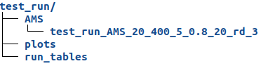
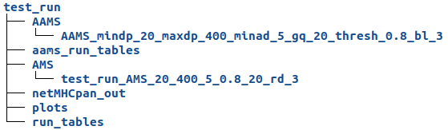

# AlloPipe

---
The AlloPipe tool currently takes two variant annotated exomes as input and returns quantitative and qualitative measurements of the differences within the pair. 

---

## Table of contents

1. [Start from scratch for your very first time: Create a conda environment](#before)
   	1. [Check the requirements](#requirements)
	2. [Install AlloPipe](#install)

2. [Run AlloPipe](#typical)
	1. [VEP annotation](#vep)
	2. [Launch AlloPipe-count](#ams_run)
	3. [Getting your AMS results](#ams_results)
	4. [Exploring the AMS mismatches table](#ams_mismatches)
	5. [Launch AlloPipe-affinity](#aams_run)
	6. [Getting your AAMS results](#aams_results)
	7. [Exploring the AAMS mismatches table](#aams_mismatches)

## Prepare the environment 
Before lauching your very first AlloPipe run, you must ensure the two upcoming steps, i.e. all the [requirements](#requirements) are set up and [AlloPipe](#install) is correctly installed 

### Requirements 

AlloPipe specifically requires
1. [VEP](https://www.ensembl.org/info/docs/tools/vep/script/vep_download.html#download) (>=v104) annotated VCF files, with the VEP information contained in the INFO field of the VCF file (online tool or command line tool, example given below).
2. [Python](https://www.python.org/downloads/) (>=3.6,developed on 3.9) and associated [packages](requirements.txt).
3. [NetMHCpan4.1](https://services.healthtech.dtu.dk/service.php?NetMHCpan-4.1) downloaded as a command line tool.

Note that in order to download NetMHCpan, you will have to fill a form on the netMHCpan website, and all the installation instructions will then be provided.  

### Install AlloPipe and the reauired packages 

To download the pipeline, clone the repository and install the required python packages needed for the pipeline to run.

	git clone http://gitlab.lcqb.upmc.fr/allogenomics/AMS_workflow.git
	cd AMS_workflow
	python -m pip install -r requirements.txt

---

## Typical run 

---
In the **input/** directory, we prepared two examples for you to play with to understand how your data should look like for the run to complete.  

### VEP annotation 

---
The VCF files that you provide to AlloPipe must be annotated with VEP. It can either be done using the online tool (if the VCF are smaller than 50 MB) or by downloading the command line tool.  

1. To use the web interface, follow this [link](https://www.ensembl.org/Tools/VEP).  
First, 

2. To install the command line tool, follow the installation tutorial available [here](https://www.ensembl.org/info/docs/tools/vep/script/vep_download.html#download).  

	During the installation, VEP will also let you choose if you want to download cache files.  
	We recommend that you download a cache file for the assembly your VCF files were annotated with to be able to run VEP offline. We tested the GRCh37 and GRCh38 Ensembl v103,v108 files.  
	
	We then recommend that you add VEP to your PATH by adding the following line to your ~/.profile or ~/.bash_profile (replace the ##path##):

		export PATH=##path/to/vep##:${PATH}
	If you are on Windows, you can follow this [tutorial](https://medium.com/@kevinmarkvi/how-to-add-executables-to-your-path-in-windows-5ffa4ce61a53) to add VEP to your PATH. 

	When you are done, run the following command at the root of the AlloPipe directory :  
	
		vep --cache --assembly GRCh38 --offline --af_gnomade -i tutorial/donor_to_annotate.vcf.gz -o tutorial/donor_annotated_VEP.vcf --vcf
		vep --cache --assembly GRCh38 --offline --af_gnomade -i tutorial/recipient_to_annotate.vcf.gz -o tutorial/recipient_annotated_VEP.vcf --vcf

**Please note that all specified options are mandatory, with the exception of the assembly if you only downloaded one cache file.**  

### Launch your first Allogenomics Mismatch Score (AMS) run  

Once the annotation is complete, go to the root of the AlloPipe directory.   
Then, run the following commands in the terminal :  

	cd src/
	python ams_pipeline.py -f -n test_run -p test_pair ../tutorial/donor_annotated_VEP.vcf ../tutorial/recipient_annotated_VEP.vcf rd

### Getting your AMS results 

After the run is complete, we look at the **output/runs/test_run/** directory that was created.  
In this directory, we have the following structure :  
1. the **AMS/** directory contains a subdirectory created for these run parameters specifically, the AMS value contained in a csv file.  
2. the **plots/** subdirectory
3. the **run_tables** subdirectory contains all the tables created during the run. 

>  
  
We also annotated the tutorial file with VEP for the donor and recipient, `donor.vcf.gz` and `recipient.vcf.gz` respectively.

Run the following command to estimate the AMS for this pair :  

	python ams_pipeline.py -f -n allopipe_run -p test_pair ../tutorial/donor.vcf.gz ../tutorial/recipient.vcf.gz rd

If you have the same AMS for both runs (it should be 49), it means your VEP annotation worked as expected !  

### Exploring the AMS mismatches table 

In the **run_tables/** directory, you can find the mismatches table that will give you direct information on the mismatched positions.  
In this table, you can find the following information :  
1. **VCF information**  
	1. **CHROM (str)**: Chromosome of the variant
	2. **POS (int)**: Position on the chromosome
	3. **ID_{x, y} (str)**: Reference SNP cluster ID for the donor (x) or recipient (y)
	4. **REF, ALT (str)**: REF and ALT alleles at the given position
	5. **QUAL_{x, y} (float)**: Phred-scaled quality score for the assertion made in ALT
	6. **FILTER_{x, y} (str)**: PASS if this position has passed all filters
	7. **FORMAT_{x, y} (list)**: Format of the sample column post AlloPipe processing
	8. **Sample_{x, y} (str)**: Sample information regarding the position. Note that the column name is the one provided in the original VCF
        - In the case of transplantation, Sample_x is the donor and Sample_y is the recipient
        - In the case of oncogenetics, Sample_x is the tumor and Sample_y is the constitutional DNA

2. **Sample information**
	1. **GT_{x, y} (str)**: Predicted genotype of the sample
	2. **GQ_{x, y} (float)**: Score of quality of the predicted genotype
	3. **AD_{x, y} (str)**: Allelic depth 
	4. **FT_{x, y} (str)**: Sample genotype filter indicating if this genotype was “called”
	5. **phased_{x, y} (str)**: Predicted genotype containing phased information (if provided in the sample column)
	6. **DP_{x, y} (int)**: Sequencing Depth at position
	7. **TYPE_{x, y} (str)**: type of genotype (homozygous, heterozygous)
3. **VEP information**
	1. **consequences_{x, y} (int)**: All the columns with a consequence with the number of times it is recorded in transcripts for the variant
	2. **transcripts_{x, y} (str)**: Transcripts recorded for the variant
	3. **genes_{x, y} (str)**: Genes recorded for the variant
	4. **aa_REF, aa_ALT (str)**: Amino-acid for REF and ALT alleles for the variant
	5. **gnomADe_AF_{x, y} (float)**: Frequency of existing variant in gnomAD exomes combined population
	6. **aa_ref_indiv_{x, y}, aa_alt_indiv_{x, y} (str)**: REF and ALT amino-acids recorded for the sample (x and y)
	7. **aa_indiv_{x, y} (str)**: REF and ALT amino-acids combined in one column
4. **AlloPipe information**
	1. **diff (str)**: difference between the amino-acids of both samples
	2. **mismatch (int)**: number of mismatches in the diff field
	3. **mismatch_type (str)**: type of mismatch (homozygous, heterozygous)

### Launch your first Affinity AMS (AAMS) run 

Once the AMS run is complete, provided you have the class 1 HLA typing of your samples, you can run a second set of commands to get a filtration of the peptides contributing to the score, using NetMHCpan.  
To run the AAMS pipeline of AlloPipe on the previous example, go to its root directory and run the following commands in the terminal :  

	cd src/
	gzip -d ../tutorial/Ensembl/Homo_sapiens.GRCh38.cdna.all.103.fa.gz && gzip -d ../tutorial/Ensembl/Homo_sapiens.GRCh38.pep.all.103.fa.gz && gzip -d ../tutorial/Ensembl/Homo_sapiens.GRCh38.103.refseq.tsv.gz
	python aams_pipeline.py -M ../output/runs/test_run/run_tables/test_pair_test_run_mismatches_20_400_5_gq_20_0.8_bl_3.tsv -T ../output/runs/test_run/run_tables/test_pair_test_run_transcripts_pair_codons_20_400_5_gq_20_0.8_bl_3.tsv -E ../tutorial/Ensembl/Homo_sapiens.GRCh38.cdna.all.103.fa -P ../tutorial/Ensembl/Homo_sapiens.GRCh38.pep.all.103.fa -R ../tutorial/Ensembl/Homo_sapiens.GRCh38.103.refseq.tsv -n test_run -p test_pair -l 9 --el_rank 2 -a HLA-A*01:01,HLA-A*02:01,HLA-B*08:01,HLA-B*27:05,HLA-C*01:02,HLA-C*07:01

### Getting your AAMS results 

This second step of AlloPipe uses the AMS information of the first step.  
You will find 3 new subdirectories in the **test_run/** directory :  
1.	the **AAMS/** directory contains a subdirectory created for these run parameters specifically, the AAMS value contained in a csv file.
2.	the **netMHCpan_out/** subdirectory contains all tables generated during the netMHCpan step.
3.	the **aams_run_tables/** subdirectory contains all the other tables created during the run

>

The AAMS value obtained with VEP v107 and netMHCpan4.1 is 34.

### Exploring the AAMS mismatches table 

If you want more in-depth information on the mismatches contributing to the AAMS, you will find a mismatches table in the **aams_run_tables/** directory.  
It contains the mismatches information from the AMS run along with information provided by netMHCpan :
1. **NetMHCpan information**
	1. **hla_peptides (str)**: Potential ligand peptide built from VEP information and Ensembl information
	2. **Gene_id (str)**: Ensembl Gene ID
	3. **NB (int)**: Number of Weak Binding/Strong Binding peptides accross given HLA
	4. **EL-score (float)**: Raw prediction score
	5. **EL_Rank (float)**: Rank of the predicted EL-score compared to a set of random natural peptides
	6. **BA-score (float)**: Binding-Affinity score
	7. **BA_Rank (float)**: Rank of the predicted BA-score
	8. **HLA (str)**: Specified MHC molecule / Allele name
	9. **Transcript_id (str)**: Ensembl Transcript ID
	10. **Peptide_id (str)**: Ensembl Peptide ID

You can now get started with your files, check the [documentation](#docs/documentation.pdf) if you want more control over the filters that we implemented.  
