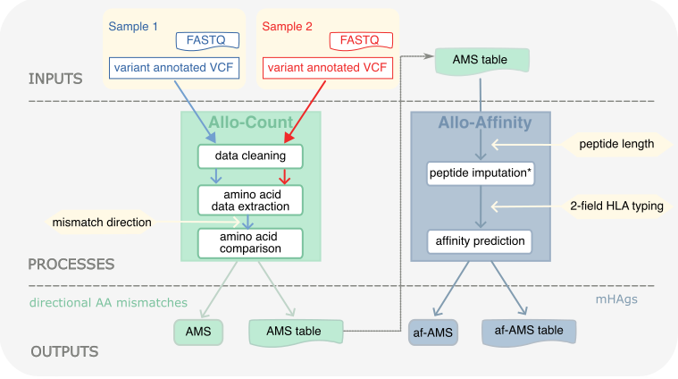

# AlloPipe


The AlloPipe tool is a computational workflow designed to compute, given a pair of annotated human genomic datasets:
  1. **directional amino acid mismatches**, and 
  2. the related candidate **minor histocompatibility antigens**. 


The product is provided free of charge, and, therefore, on an "as is" basis, without warranty of any kind. <br/>
AlloPipe is also available as a [web application](https://www.allogenomics.com).

### AlloPipe is now published in HLA:
A. Dhuyser, P. Delaugère, P. Laville, et al., AlloPipe and Its Web Server Allogenomics: From Genomic Data to Candidate Minor Histocompatibility Antigens, HLA 107, no. 2 (2026): e70590.

Full text: https://doi.org/10.1111/tan.70590. 

---
## In a nutshell

**The AlloPipe tool is divided into two sequential modules: Allo-Count, then Allo-Affinity.**


<br/>
<p align="center">
	
</p>

<br/>

### (1) Allo-Count imputes the directional amino acid mismatches from two genomic datasets

After reformating relevant data from the variant-annotated `.VCF` file(s), Allo-count performs a stringent data cleaning and computes the **directional comparison** of the genomic sequences from sample 1 and sample 2. 

 <br/>
 
 Allo-Count returns: <br/>
- **a quantitative output** called the **Allogenomic Mismatch Score (AMS)**: a discrete quantitative variable that is counting the number of directional amino acid mismatches.
- **a qualitative output** stored in the **AMS (mismatch) table**: providing information about the polymorphisms contributing to the AMS.
  
<br/>  

> **Directional comparison**
> 
> The sample comparison is directional and accounts for either polymorphisms that are present in the donor 
> but absent in the recipient (*donor-to-recipient*) or that are present in the recipient but absent in the donor (*recipient-to-donor*).
>  - **_Donor-to-recipient_** accounts for polymorphisms present by the donor but absent by the recipient, i.e. triggerring the recipient's immune system after **solid organ transplantation**.
>   - **_Recipient-to-donor_** accounts for polymorphisms present by the recipient but absent by the donor, i.e. triggerring the donor's immune system after **allogeneic haematopoietic cell transplantation**.

<br/>
<br/>

### (2) Allo-Affinity imputes minor histocompatibility antigen (mHAgs) candidates

Allo-Affinity **reconstructs peptides** of requested length around the polymorphisms present in the mismatches tables.<br/>
The affinity of those peptides towards the HLA molecules can then be assessed using third party tools such as [NetMHCpan](https://pubmed.ncbi.nlm.nih.gov/32406916/) or [MixMHCpred](https://www.biorxiv.org/content/10.1101/2024.05.08.593183v1) softwares, to retrieve the candidate mHAgs.

*Please read the terms of use for the NetMHCpan and MixMHCpred softwares. 4-digit HLA typing must be provided by the user for the HLA molecules of interest, including the alpha/beta chain combination for HLA-DR and HLA-DQ molecules.*


<br/>
<br/>

### Modes of operation (single pair or multiple pair/cohort)

There are two modes of operation for each module: as single pair or as multiple pairs
	
- **Single pair**: 
Run as 'single pair mode' if you aim to compute Allo-Count and/or Allo-Affinity for one pair at a time. \
You need to provide one variant-annotated `.VCF` file per individual.
 
- **Cohort** (Multiple pairs): 
Run through the Nextflow cohort workflow if you aim to compute Allo-Count and/or Allo-Affinity for more than one pair at a time.\
You need to provide one unique variant-annotated `.VCF` file containing the genotypes of all individuals you want to analyse - i.e. a joint `.VCF` file - and the [`.csv` formatted list](./tutorial/example.csv) of the pairs you want to process.
For cohort mode, the pair list can also carry a per-pair `hla` column with a comma-separated HLA typing string.

<br/>

---

# Table of contents

1. [Before getting started](#before)
	1. [Requirements](#requirements)
	2. [AlloPipe installation](#install)
	3. [Preprocessing the input data: variant annotation](#vep)
    
<br/>

2. [Running the AlloPipe workflow](#run)
	1. [Nextflow workflow: pair or cohort mode](#nextflow_run)
	1. [Running Allo-Count](#ams_run)
		1. [Single pair](#single_ams)
		2. [Multiple pairs](#multi_ams)
		3. [Exploring the AMS table](#ams_table)
	2. [Running Allo-Affinity](#aams_run)
		1. [Single pair](#single_aams)
		2. [Multiple pairs](#multi_aams)
		3. [Exploring the af-AMS table](#aams_table)
		4. [Predicting cleaved peptide](#cleavage)

3. [Tutorial](#tuto)

<br/>

---

## Before getting started <a name="before"></a>

### &nbsp;&nbsp;&nbsp;&nbsp;&nbsp;&nbsp;&nbsp;&nbsp;(i) Requirements<a name="requirements"></a>

For installing AlloPipe you will specifically require the following softwares:
1. [Nextflow](https://www.nextflow.io/) 24.10.9 installed to run the AlloPipe workflow.

2. [Conda](https://docs.conda.io/projects/conda/en/latest/user-guide/install/index.html) installed for your operating system. The Nextflow workflow uses Conda to create its execution environment from [`recipes/conda/allopipe.yml`](recipes/conda/allopipe.yml). AlloPipe is currently developed on Python v3.10.

3. To run Allo-Affinity, you need to assess the affinity of the reconstructed peptides towards the HLA molecules. We recommend two groups of software suites for that (only NetMHCpan is supported in command line for now):
	- [NetMHCpan](https://services.healthtech.dtu.dk/service.php?NetMHCpan-4.1) and [NetMHCIIpan](https://services.healthtech.dtu.dk/services/NetMHCIIpan-4.3/), which should be downloaded as command line tools (be careful with version numbers).
	- [MixMHCpred](https://github.com/GfellerLab/MixMHCpred) and [MixMHC2pred](https://github.com/GfellerLab/MixMHC2pred) (support development in progress).
4. To predict proteasomal cleavage on the proteins of the donor or the recipient, you will also need the [NetChop](https://services.healthtech.dtu.dk/services/NetChop-3.1/) tool installed as a standalone version. 

*Make sure you use each software in accordance with its user license.*

 
<br/>

### &nbsp;&nbsp;&nbsp;&nbsp;&nbsp;&nbsp;&nbsp;&nbsp;(ii) AlloPipe installation <a name="install"></a>

1) Clone the repository from git\
*You might be requested to create a token for you to log in. See the [GitHub tutorial](https://docs.github.com/en/authentication/keeping-your-account-and-data-secure/managing-your-personal-access-tokens#creating-a-personal-access-token-classic)*

2) Run AlloPipe through the Nextflow workflow
   
The following command lines will clone the repository and show the workflow help:
```
	git clone https://github.com/huguesrichard/Allopipe.git
	cd Allopipe
	nextflow run main.nf --help
```
1) Remember that to run prediction of affinity for the peptides you will also need NetMHCpan installed (NetChop to account for proteasomal cleavage).

### &nbsp;&nbsp;&nbsp;&nbsp;&nbsp;&nbsp;&nbsp;&nbsp;(iii) Preprocess the input data: variant annotation <a name="vep"></a>

<br/>

**AlloPipe input file(s) must be variant-annotated `.VCF` file(s). We highly recommend performing the variant annotation with the most recent version of VEP using the command line installation and all the arguments specified below.**

<br/>

>*Any variant annotator could be used at this step, but keep in mind that AlloPipe has been developed with `.VCF` files in version 4.2 annotated with VEP command line installation for versions older than 103.*

<br/>

To install the VEP command line tool, follow the installation tutorial available [here](https://www.ensembl.org/info/docs/tools/vep/script/vep_download.html#download).\
		During the installation, you will be asked if you want to download **cache** files, **FASTA** files and **plugins**.
   - We **recommend downloading the cache files** for the assembly of your `.VCF` files to be able to run VEP offline.\
	Download the VEP cache files which correspond to your Ensembl VEP installation and genome reference!
   - We **recommend downloading the FASTA files** for the assembly of your `.VCF` files to be able to run VEP offline.\
	Download the FASTA files which correspond to your Ensembl VEP installation and genome reference!
   - In default mode, we **do not recommend downloading any plugin**, except the Frameshift plugin when frameshift neoantigen handling is required. See the [Frameshift plugin section](#frameshift_plugin).
      
 We then recommend **adding VEP to your PATH** by adding the following line to your `~/.profile` or `~/.bash_profile`:
```
export PATH=%%PATH/TO/VEP%%:${PATH}
```


Run the following command to annotate your `.VCF` file(s) with VEP.

**All specified options are mandatory, with the exception of the assembly if you only downloaded one cache file.**  


```
vep --fork 4 --cache --assembly <GRChXX> --offline --af_gnomade -i <FILE-TO-ANNOTATE>.vcf -o <ANNOTATED-FILE>.vcf --coding_only --pick_allele --use_given_ref --vcf
```

Where:
 - ```<GRChXX>``` is the version of the genome used to align the sequences.
 - ```<FILE-TO-ANNOTATE>.vcf``` is the path to your file to annotate.
 - ```<ANNOTATED-FILE>.vcf``` is the path to the output annotated file.

This command line works for individual `.VCF` files or joint `.VCF` files, whether compressed (`.vcf.gz`) or not (`.vcf`). 
Run this command for every file you want to input in AlloPipe.

When using the Nextflow workflow with automatic VEP annotation enabled, AlloPipe selects the VEP assembly from `--ensembl_path`. The path must contain `GRCh37` or `GRCh38`; for example, `--ensembl_path data/Ensembl/GRCh38` uses `GRCh38` for VEP annotation.

**Once the variant-annotation of your file(s) is(are) complete, you are now ready to run your first AlloPipe run!**

<br/>

#### Frameshift plugin <a name="frameshift_plugin"></a>

If you want to take into account frameshift neoantigens peptide generation in the af-AMS, you need to add the [Frameshift plugin](https://github.com/griffithlab/pVACtools/blob/0c05768b7b9b317eebdeeb2a7a178b8a12c880d6/pvactools/tools/pvacseq/VEP_plugins/Frameshift.pm) from the [pVACtools](https://github.com/griffithlab/pVACtools) software to your VEP installation.

```
mv Frameshift.pm ~/.vep/Plugins
```

You should then add these options to the VEP command:

```
--plugin Frameshift --dir_plugins <PLUGIN-PATH>
```

with ```<PLUGIN-PATH>``` being the path to your VEP plugins directory.


<br/>

---

## Running the AlloPipe workflow <a name="run"></a>

### &nbsp;&nbsp;&nbsp;&nbsp;&nbsp;&nbsp;&nbsp;&nbsp; Nextflow workflow: pair or cohort mode <a name="nextflow_run"></a>

The Nextflow workflow runs the two AlloPipe modules in sequence: Allo-Count, then Allo-Affinity. It can process either one donor/recipient pair (`--mode pair`) or several pairs from a cohort/joint VCF (`--mode cohort`).

Run commands from the root of the AlloPipe directory.

Each run must use a unique output destination. The directory formed by `--output_dir` and `--run_name` (`<output_dir>/runs/<run_name>`) must not already exist; if it does, AlloPipe stops before launching the workflow. Use a new `--run_name` or a different `--output_dir` for a new run.

#### Required arguments in pair mode

Use pair mode when you have one VCF file for the donor and one VCF file for the recipient. Because `pair` is the default value of `--mode`, passing `--mode pair` is optional.

| Argument | Required | Description |
| -------- | -------- | ----------- |
| `--mode pair` | no | Selects single-pair mode. Default: `pair`. |
| `--donor <VCF>` | yes | Donor VCF file (`.vcf` or `.vcf.gz`). |
| `--recipient <VCF>` | yes | Recipient VCF file (`.vcf` or `.vcf.gz`). |
| `--run_name <NAME>` | yes | Unique name used for the output run directory. `<output_dir>/runs/<NAME>` must not already exist. |
| `--orientation dr` or `--orientation rd` | yes | Direction of the mismatch comparison: `dr` for donor-to-recipient, `rd` for recipient-to-donor. |
| `--imputation imputation` or `--imputation no-imputation` | yes | Missing genotype handling mode. Individual VCFs usually use `imputation`. |
| `--ensembl_path <DIR>` | yes | Ensembl data directory used by Allo-Affinity. The path must contain `GRCh37` or `GRCh38` so the workflow can automatically select the VEP assembly. |
| `--hla_typing <HLA_LIST>` | yes | Comma-separated HLA typing used by Allo-Affinity. |

Example:

```
nextflow run main.nf -profile conda \
	--mode pair \
	--donor tutorial/HG002-VEPannotated.vcf \
	--recipient tutorial/HG007-VEPannotated.vcf \
	--run_name test_pair \
	--orientation dr \
	--imputation imputation \
	--ensembl_path data/Ensembl/GRCh38 \
	--hla_typing "HLA-A*01:01,HLA-A*02:01,HLA-B*08:01,HLA-B*27:05,HLA-C*01:02,HLA-C*07:01" \
	--skip_vep_annotation true
```

#### Required arguments in cohort mode

Use `--mode cohort` when several donor/recipient pairs must be extracted from one joint multi-sample VCF.

| Argument | Required | Description |
| -------- | -------- | ----------- |
| `--mode cohort` | yes | Selects cohort mode. Required when running a cohort, because the default mode is `pair`. |
| `--multi_vcf <VCF>` | yes | Joint multi-sample VCF containing all donors and recipients. |
| `--pairs <CSV>` | yes | CSV file describing the donor/recipient pairs and per-pair HLA typing. |
| `--run_name <NAME>` | yes | Unique name used for the output run directory. `<output_dir>/runs/<NAME>` must not already exist. |
| `--orientation dr` or `--orientation rd` | yes | Direction of the mismatch comparison for all pairs in the run. |
| `--imputation imputation` or `--imputation no-imputation` | yes | Missing genotype handling mode. Joint VCF cohort runs usually use `no-imputation`. |
| `--ensembl_path <DIR>` | yes | Ensembl data directory used by Allo-Affinity. The path must contain `GRCh37` or `GRCh38` so the workflow can select the VEP assembly. |

The cohort CSV must contain at least the columns `donor`, `recipient`, and `hla`. The `hla` column is mandatory and must be the last column because HLA values are comma-separated.

Example:

```
nextflow run main.nf -profile conda \
	--mode cohort \
	--multi_vcf tutorial/HG002-HG007-VEPannotated.vcf \
	--pairs tutorial/example.csv \
	--run_name test_cohort \
	--orientation dr \
	--imputation no-imputation \
	--ensembl_path data/Ensembl/GRCh38 \
	--skip_vep_annotation true
```

#### Common optional arguments

| Argument | Description |
| -------- | ----------- |
| `--output_dir <DIR>` | Base output directory. Default: `output`. |
| `--skip_vep_annotation true` | Skip the built-in VEP annotation step when the input VCFs are already VEP-annotated. |
| `--vep_cache <DIR>` | VEP cache path inside the execution environment. Default: `/cache`. |
| `--vep_version <TAG>` | VEP container tag used by the VEP process. Default: `release_113.4`. To change the workflow default, edit `params.vep_version` in `nextflow.config`. |
| `--frameshift true` | Enable frameshift neoantigen handling. Requires VEP Frameshift plugin annotation. |
| `--frameshift_plugin_path <PATH>` | Path to the VEP `Frameshift.pm` plugin or plugin directory. |
| `--allo_count_opts "<OPTIONS>"` | Extra options passed to the Allo-Count step, for example filtering thresholds. |
| `--allo_affinity_opts "<OPTIONS>"` | Extra options passed to the Allo-Affinity step, for example `--length`, `--el_rank`, `--class_type`, `--cleavage`, or `--dry_run` to skip the long NetMHCpan computation. |

### &nbsp;&nbsp;&nbsp;&nbsp;&nbsp;&nbsp;&nbsp;&nbsp; (i)Running Allo-Count  <a name="ams_run"></a>

<br/>

**Which parameters Allo-Count considers?**

From variant-annotated `.VCF` file(s), data are first reformatted to obtain one data frame per individual.\
Those data frames are then filtered considering a set of quality metrics (defaults values):
- minimal depth per position (20x)
- maximal depth per position (400x)
- minimal allelic depth (5x)
- homozygosity threshold (0.2)
- GnomADe allele frequency threshold (0.01)
- genotype quality threshold (0: you might adjust this value according to your sequencing platform)
- maximal length for insertions or deletions (indels, 3)

The curated data frames are then queried to assess the **directional mismatches** between samples.

<br/>

> **Directional comparison**
> 
> The sample comparison is **directional** and accounts for either polymorphisms that are present in the donor but absent in the recipient (*donor-to-recipient*) or that are present in the recipient but absent in the donor (*recipient-to-donor*).
> - **_Donor-to-recipient_** accounts for polymorphisms present by the donor but absent by the recipient, i.e. triggering the recipient's immune system after **solid organ transplantation**.
> - **_Recipient-to-donor_** accounts for polymorphisms present by the recipient but absent by the donor, i.e. triggering the donor's immune system after **allogenic hematopoietic cell transplantation**.
> 
<br/>

**How does AlloPipe handle missing data?**

We provide the possibility to impute genotype missing data as being ref/ref (e.g. `0/0` or homozygous on the nucleotide of reference.
 - If you are using individual `.VCF` files as input ('single pair mode'), you most probably want to run with the `imputation` argument as ref/ref variants are omitted in those files.

 - If you are using a joint `.VCF` through the Nextflow cohort workflow, running with the `no-imputation` argument will only keep variants sequenced in the two datasets of each pair.
<br/>

#### &nbsp;&nbsp;&nbsp;&nbsp;&nbsp;&nbsp;&nbsp;&nbsp;&nbsp;&nbsp;&nbsp;&nbsp;&nbsp;&nbsp;&nbsp;&nbsp; (a) Running Allo-Count for a single pair <a name="single_ams"></a>

Once variant annotation is complete, run Allo-Count through the Nextflow pair workflow from the root of the AlloPipe directory. The workflow also launches the Allo-Affinity step, so `--hla_typing` and `--ensembl_path` are required.

```
nextflow run main.nf -profile conda \
	--mode pair \
	--donor tutorial/HG002-VEPannotated.vcf \
	--recipient tutorial/HG007-VEPannotated.vcf \
	--run_name test_pair \
	--orientation dr \
	--imputation imputation \
	--ensembl_path data/Ensembl/GRCh38 \
	--hla_typing "HLA-A*01:01,HLA-A*02:01,HLA-B*08:01,HLA-B*27:05,HLA-C*01:02,HLA-C*07:01" \
	--skip_vep_annotation true
```

More detailed help can be obtained with `nextflow run main.nf --help`.

For instance, you can generate frameshift neoantigen candidates by adding `--frameshift true` to the Nextflow command. Note: you need to have installed the VEP `Frameshift` plugin.

<br/>


#### &nbsp;&nbsp;&nbsp;&nbsp;&nbsp;&nbsp;&nbsp;&nbsp;&nbsp;&nbsp;&nbsp;&nbsp;&nbsp;&nbsp;&nbsp;&nbsp; (b) Running Allo-Count for multiple pairs <a name="multi_ams"></a>

Multiple-pair execution is handled by the Nextflow cohort workflow. Use an annotated or unannotated joint `.VCF` file containing the genomic data of interest and provide a CSV file specifying donor/recipient pairs.

*Only one directional comparison is accepted within the same command line.*

```
nextflow run main.nf -profile conda \
	--mode cohort \
	--multi_vcf tutorial/HG002-HG007-VEPannotated.vcf \
	--pairs tutorial/example.csv \
	--run_name test_cohort \
	--orientation dr \
	--imputation no-imputation \
	--ensembl_path data/Ensembl/GRCh38 \
	--skip_vep_annotation true
```

Again, more detailed help can be obtained with `nextflow run main.nf --help`.


#### &nbsp;&nbsp;&nbsp;&nbsp;&nbsp;&nbsp;&nbsp;&nbsp;&nbsp;&nbsp;&nbsp;&nbsp;&nbsp;&nbsp;&nbsp;&nbsp; (c) Exploring the Allo-Count output <a name="ams_table"></a>

After the run is complete, have a look at the **output/runs/NAME-RUN/** directory that was created.  
The directory is structured as followed :  
 - the **`AMS/`** subdirectory contains the AMS value(s)
 - the **`plots/`** subdirectory contains visual output
 - the **`run_tables/`** subdirectory contains the tables created during the run. 

In the **`run_tables/`** directory, you can find:

<br/>

&nbsp;&nbsp;&nbsp;&nbsp;&nbsp;&nbsp; **1)** **`D0-TABLE`** and **`R0-TABLE`**: 
The D0/R0 tables are tab delimited files that summarize the genotype information contained in the `.VCF` file(s), whether individual or joint.

They can be used to navigate through this data in a more simple way, by opening them with a spreadsheet software.


&nbsp;&nbsp;&nbsp;&nbsp;&nbsp;&nbsp; **2)** The **`MISMATCHES-TABLE`**: 
This table gives you information on the mismatched positions. For each type of information (VCF, Sample, VEP, AlloPipe results), the columns names are the following (types given in parenthesis)


1. **VCF information:**  
- **CHROM (str)**: Chromosome of the variant
- **POS (int)**: Position on the chromosome
- **ID_{x, y} (str)**: Reference SNP cluster ID for the donor (x) or recipient (y)
- **REF, ALT (str)**: REF and ALT alleles at the given position
- **QUAL_{x, y} (float**: Phred-scaled quality score for the assertion made in ALT
- **FILTER_{x, y} (str)**: PASS if this position has passed all filters
- **FORMAT_{x, y} (list)**: Format of the sample column post AlloPipe processing
- **Sample_{x, y} (str)**: Sample information regarding the position. Note that the column name is the one provided in the original `.VCF`
    - In the case of transplantation, `Sample_x` is the donor and `Sample_y` is the recipient

2. **Sample information:**
- **GT_{x, y} (str):** Predicted genotype of the sample
- **GQ_{x, y} (float):** Score of quality of the predicted genotype
- **AD_{x, y} (str):** Allelic depth
- **FT_{x, y} (str):** Sample genotype filter indicating if this genotype was “called”
- **phased_{x, y} (str):** Predicted genotype containing phased information (if provided in the sample column)
- **DP_{x, y} (int):** Sequencing Depth at position
- **TYPE_{x, y} (str):** type of genotype (homozygous, heterozygous)

3. **VEP information**: 
- **consequences_{x, y} (int)**: Count of each consequence type (i.e. frameshift indel, missense variant, ...)
- **transcripts_{x, y} (str)**: Transcripts recorded for the variant
- **genes_{x, y} (str)**: Genes recorded for the variant
- **aa_REF, aa_ALT (str)**: Amino-acid for REF and ALT alleles for the variant
- **gnomADe_AF_{x, y} (float)**: Frequency of existing variant in gnomAD exomes combined population
- **Frameshift_sequence_{x, y} (str):** Frameshift sequences annotated by VEP (if `--frameshift` is activated, empty otherwise)
- **aa_ref_indiv_{x, y}, aa_alt_indiv_{x, y} (str)**: REF and ALT amino acids recorded for the sample (x and y)
- **aa_indiv_{x, y} (str)**: REF and ALT amino acids combined in one column

1. **AlloPipe information:**
- **diff (str)**: difference between the amino acids of both samples
- **mismatch (int)**: number of mismatches in the diff field
- **mismatch_type (str)**: type of mismatch (homozygous, heterozygous)


&nbsp;&nbsp;&nbsp;&nbsp;&nbsp;&nbsp; **3)** The **`TRANSCRIPTS-TABLE`**:
This table contains mandatory data to perform the reconstruct peptides in the second step
<br/>

### &nbsp;&nbsp;&nbsp;&nbsp;&nbsp;&nbsp;&nbsp;&nbsp; (ii)Run Allo-Affinity <a name="aams_run"></a>

**What does the Allo-Affinity tool do?**

From previously generated files that are the `MISMATCHES-TABLE` and the `TRANSCRIPTS-TABLE`, **Allo-Affinity reconstructs the set of peptides that are different between the donor and the recipient.** All the peptides of a given length (defined by the user) are generated around mismatch position using the principle of a sliding window.

**The directionality of the mismatch is kept**, meaning that:
- if Allo-Count has been run in the *donor-to-recipient* direction (`dr`), only peptides exhibiting a polymorphism present by the donor but absent from the recipient will be reconstructed.
- In the same way, if Allo-Count has been run within the *recipient-to-donor direction* (`rd`), only peptides exhibiting a polymorphism present by the recipient but absent from the donor will be reconstructed.


#### Required files by Allo-Affinity 
 
> To reconstruct the peptides, you will need the following files (*replace XXX by the version of Ensembl used by VEP in the following links*):
> - `Homo_sapiens.<REFERENCE-GENOME>.cdna.all.fa.gz`: [https://ftp.ensembl.org/pub/release-XXX/fasta/homo_sapiens/cdna](https://ftp.ensembl.org/pub/release-XXX/fasta/homo_sapiens/cdna)
> - `Homo_sapiens.<REFERENCE-GENOME>.pep.fa.gz`: [https://ftp.ensembl.org/pub/release-XXX/fasta/homo_sapiens/pep](https://ftp.ensembl.org/pub/release-XXX/fasta/homo_sapiens/pep)
> - `Homo_sapiens.<REFERENCE-GENOME>.<VEP-VERSION>.refseq.tsv.gz`: [https://ftp.ensembl.org/pub/release-XXX/tsv/homo_sapiens/](https://ftp.ensembl.org/pub/release-XXX/tsv/homo_sapiens/)
> 
>
>
> **Please be aware the number of the Ensembl release has to be the same as the one used by the VEP tool version that generated the annotated VCF.**
> 
> Do not forget to select the reference genome used to perform the alignment.
> We provide the v111 of those files for GRCh37 and GRCh38 [here](./data/Ensembl).

Before running a Nextflow command that launches Allo-Affinity, unzip the files corresponding to your assembly (GRCh37 or GRCh38):

```
gzip -d data/Ensembl/GRCh38/*
```

<br/>

Allo-Affinity output those peptides in a fasta file that can be processed by the following third party softwares:
 - [NetMHCpan4.1](https://services.healthtech.dtu.dk/services/NetMHCpan-4.1/)
 - [NetMHCIIpan4.3](https://services.healthtech.dtu.dk/services/NetMHCIIpan-4.3/) 
 - [MixMHCPred](https://github.com/GfellerLab/MixMHCpred)
 - [MixMHC2Pred](https://github.com/GfellerLab/MixMHC2pred)


Each of these tool imputes the affinity of the reconstructed peptides towards the HLA peptide grooves, therefore outputs **candidate minor histocompatibility antigens (mHAgs)**.
**Please note that the HLA typing has to be known before running the command line**, as the AlloPipe tool does not impute the HLA typing from genomic data.

*Hint: You can use [nfcore-HLAtyping](https://github.com/nf-core/hlatyping) to assess the HLA class I from exome data.*

<br/>

#### &nbsp;&nbsp;&nbsp;&nbsp;&nbsp;&nbsp;&nbsp;&nbsp;&nbsp;&nbsp;&nbsp;&nbsp;&nbsp;&nbsp;&nbsp;&nbsp; 1. Simple pair <a name="single_aams"></a>

Allo-Affinity is run automatically after Allo-Count by the Nextflow workflow. Some parameters are handled directly by Nextflow, while others are still passed to the Python Allo-Affinity step through `--allo_affinity_opts`.

```
nextflow run main.nf -profile conda \
	--mode pair \
	--donor tutorial/HG002-VEPannotated.vcf \
	--recipient tutorial/HG007-VEPannotated.vcf \
	--run_name test_pair_affinity \
	--orientation dr \
	--imputation imputation \
	--ensembl_path data/Ensembl/GRCh38 \
	--hla_typing "HLA-A*01:01,HLA-A*02:01,HLA-B*08:01,HLA-B*27:05,HLA-C*01:02,HLA-C*07:01" \
	--skip_vep_annotation true \
```

Nextflow arguments:
  - `--run_name` is the unique name of the run
  - `--ensembl_path` is the path to the Ensembl files previously downloaded: `.cdna.fa`, `.pep.fa` and `.refseq.tsv`
  - `--hla_typing` is the HLA typing, e.g. `HLA-A*01:01,HLA-A*02:01,HLA-B*08:01,HLA-B*27:05,HLA-C*01:02,HLA-C*07:01`

Python Allo-Affinity arguments passed through `--allo_affinity_opts`:
  - `--length` is the length of peptides to be imputed (default: 9 for class I)
  - `--el_rank` is the elution threshold (default: 2 for class I)
  - `--dry_run` skips the long NetMHCpan computation

For example:

```
--allo_affinity_opts "--length --el_rank"
```

 
<br/>

> **Note on providing HLA typing**
> 
> Allo-Affinity lets you be flexible in providing the HLA alleles used for typing, as long as they can be set as parameters for the affinity prediction program (NetMHCpan for the moment).
> In pair mode, pass them with `--hla_typing`. In cohort mode, provide them per pair in the mandatory `hla` column of the cohort CSV.
> In most scenarios you should provide both HLA alleles to compute affinity, but it is perfectly possible to provide for instance only one allele (as could be the case for bone marrow transplantation).


#### Multiple pairs <a name="multi_aams"></a>

Multiple-pair Allo-Affinity execution is also handled by the Nextflow cohort workflow. Provide the same pair list as the Allo-Count step, with a per-pair `hla` column containing the HLA typing to use for each donor/recipient pair.


### &nbsp;&nbsp;&nbsp;&nbsp;&nbsp;&nbsp;&nbsp;&nbsp;&nbsp;&nbsp;&nbsp;&nbsp;&nbsp;&nbsp;&nbsp;&nbsp; 2. Getting your affinity-AMS (af-AMS) <a name="aams_results"></a>

This second step of AlloPipe uses the AMS information of the first step.  
You will find 3 new subdirectories in the **`output/runs/<run_name>/`** directory:  
1.	the **`AAMS/`** directory contains a subdirectory created for these run parameters specifically, the AAMS value contained in a `.csv` file.
2.	the **`netMHCpan_out/`** subdirectory contains all tables generated during the NetMHCpan step.
3.	the **`aams_run_tables/`** subdirectory contains all the other tables created during the run

#### &nbsp;&nbsp;&nbsp;&nbsp;&nbsp;&nbsp;&nbsp;&nbsp;&nbsp;&nbsp;&nbsp;&nbsp;&nbsp;&nbsp;&nbsp;&nbsp; 3. Exploring the Allo-Affinity output <a name="aams_mismatches"></a>

If you want more in-depth information on the mismatches contributing to the AAMS, you will find a mismatches table in the **`aams_run_tables/`** directory.  
It contains the mismatches information from the AMS run along with information provided by NetMHCpan :
1. **NetMHCpan information**
- **hla_peptides (str)**: Potential ligand peptide built from VEP information and Ensembl information
- **Gene_id (str)**: Ensembl Gene ID
- **NB (int)**: Number of Weak Binding/Strong Binding peptides accross given HLA
- **EL-score (float)**: Raw prediction score
- **EL_Rank (float)**: Rank of the predicted EL-score compared to a set of random natural peptides
- **BA-score (float)**: Binding-Affinity score
- **BA_Rank (float)**: Rank of the predicted BA-score
- **HLA (str)**: Specified MHC molecule / Allele name
- **Transcript_id (str)**: Ensembl Transcript ID
- **Peptide_id (str)**: Ensembl Peptide ID

<br/>

### &nbsp;&nbsp;&nbsp;&nbsp;&nbsp;&nbsp;&nbsp;&nbsp;&nbsp;&nbsp;&nbsp;&nbsp;&nbsp;&nbsp;&nbsp;&nbsp; 4. Predicting cleaved peptides <a name="cleavage"></a>

AlloPipe can also run the [NetChop](https://services.healthtech.dtu.dk/services/NetChop-3.1/) tool to annotate the potential proteasomal cleavage sites on the proteins that contain mismatch. This then give you a reduced set of candidate peptides that you can compare with their affinity values.

The cleaved sites are predicted on a protein sequence which depends of the directionality of the run:
- `dr` direction: Proteins reconstructed from the genotype of the *donor*.
- `rd` direction: Proteins reconstructed from the genotype of the *recipient*.

2. **Cleaved peptide information**

More information about the cleaved peptide is available in the **`netChop/`** directory in the `netchop_table.csv` file, which contains the following information.
 - **CHROM** (str): Chromosome of the variant
 - **POS** (int): Position on the chromosome
 - **Protein_position** (str): Position on the protein
 - **Gene_id** (str): Ensembl Gene ID
 - **Transcript_id** (str): Ensembl Transcript ID
 - **Peptide_id** (str): Ensembl Peptide ID
 - **Sequence_aa** (str): Amino acid sequence of the peptide
 - **aa_REF** (str): Amino acid for REF
 - **aa_ALT** (str): Amino acid for ALT
 - **peptide_ALT** (str): Amino acid sequence of the peptide with mutation(s)

Each row of the table corresponds to a cleaved peptide on a protein that contributes to a mismatch in the AMS.

## Tutorial <a name="tuto"></a>

We provide a couple of example data in `/tutorial`, i.e. `tutorial/donor_to_annotate.vcf` and `tutorial/recipient_to_annotate.vcf` *(those files correspond to human chr6)*.


To test your VEP installation (`v111` in this tutorial), run the following commands:  
```
	vep --fork 4 --cache --assembly GRCh38 --offline --af_gnomade -i tutorial/donor_to_annotate.vcf -o tutorial/donor_annotated_vep111.vcf --coding_only --pick_allele --use_given_ref  --vcf
	vep --fork 4 --cache --assembly GRCh38 --offline --af_gnomade -i tutorial/recipient_to_annotate.vcf -o tutorial/recipient_annotated_vep111.vcf --coding_only --pick_allele --use_given_ref  --vcf 
```

Once the VEP annotation is complete, go to the root of the AlloPipe directory to run the workflow:

```
nextflow run main.nf -profile conda \
	--mode pair \
	--donor tutorial/HG002-VEPannotated.vcf \
	--recipient tutorial/HG007-VEPannotated.vcf \
	--run_name test-run \
	--orientation rd \
	--imputation no-imputation \
	--ensembl_path data/Ensembl/GRCh38 \
	--hla_typing "HLA-A*01:01,HLA-A*02:01,HLA-B*08:01,HLA-B*27:05,HLA-C*01:02,HLA-C*07:01" \
	--skip_vep_annotation true
```

The expected AMS are:

|  Orientation   |   Imputation    | No imputation |
| ------------   | --------------- | ------------- |
|  HSCT = `rd`   |       2812      |      42       | 
|  SOT = `dr`    |       1155      |      34       | 

The same Nextflow command also runs Allo-Affinity and writes the af-AMS and related tables in the output run directory.

<br/>

If you want to run the cleaved peptide prediction, add `--allo_affinity_opts="--cleavage"` to the Nextflow command.

You can now enjoy AlloPipe. If you have any feedback, please get in touch, we will be happy to help!
